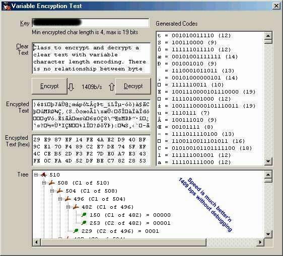



## Unbreakable Encryption \(?\)

### Description

Class to encrypt and decrypt a clear text with variable character length encoding. There is no relationship between byte boundaries and encrypted characters, ie an encrypted character may theoretically be anything from 1 to 255 bits long; however this depends on the 'quality' of the key. I am not a cryptoanalyst, but I have a hunch that the variable character length makes this code rather difficult if not impossible to break. One approach may be to scan the encryption for repeating bit-groups and guess the meaning of short groups occuring more frequently than others (like "the", "a", "an" and so forth), or for patterns occuring with a language-specific frequency of vowels and consonants. To forestall that, the encrypting engine uses an initial hash (also derived from the key) and XORs every character with that before encrypting, keeping the result of the XOR for the next character. The decrypting engine of course reverses that process.

The encryption engine now features an MD5 message digester which produces a key- and message-dependent binary signature. This signature may be included in the encrypted text to verify it's authenticity. Another advantage of prefixing a message with a signature is the additional scrambling of the encryted text through the previous encrypting of the unpredictable signature (see 'hash' above). This makes the encryption key- and text-dependent, that is, the encryption for a particular character is different when the text is different (apart from being different through hashing).

Speed (without debugging) is in excess of 40,000 bytes/sec for encrypting and more than 130,000 bps for decrypting (depending of course on your PC's clock frequency).
 
### More Info
 

             |
---                |---
**Submitted On**   |2002-02-06 14:48:06
**By**             |[ULLI](https://github.com/Planet-Source-Code/PSCIndex/blob/master/ByAuthor/ulli.md)
**Level**          |Advanced
**User Rating**    |4.2 (50 globes from 12 users)
**Compatibility**  |VB 6\.0
**Category**       |[Encryption](https://github.com/Planet-Source-Code/PSCIndex/blob/master/ByCategory/encryption__1-48.md)
**World**          |[Visual Basic](https://github.com/Planet-Source-Code/PSCIndex/blob/master/ByWorld/visual-basic.md)
**Archive File**   |[Unbreakabl53423262002\.zip](https://github.com/Planet-Source-Code/ulli-unbreakable-encryption__1-31536/archive/master.zip)

